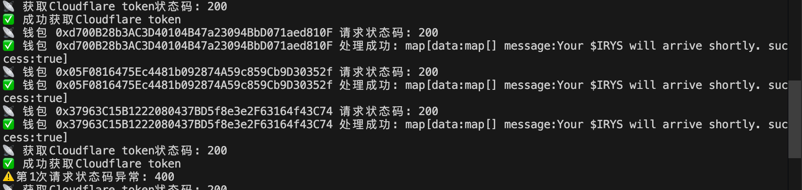

# Irys Faucet Bot

这是一个用于自动领取 Irys Faucet 的机器人程序。使用 Go 语言开发，支持多线程并发处理多个钱包地址。



- [DataImpulse 住宅动态代理](https://dataimpulse.com/?aff=38616) - 1$/1GB 的住宅动态代理服务
- [NoCaptcha 验证码解码平台](https://www.nocaptcha.io/register?c=Ka7soJ) - 验证码解码服务 


## 功能特点

- 🚀 支持多线程并发处理
- 🔄 自动重试机制
- 🔒 支持代理设置
- 🛡️ 自动处理 Cloudflare 验证
- 📝 详细的日志输出
- ⚡ 高性能处理

## 系统要求

- Go 1.16 或更高版本
- 网络连接
- 代理服务器（可选）

## 安装步骤

1. 克隆仓库：
```bash
git clone [仓库地址]
cd irysbot
```

2. 安装依赖：
```bash
go mod tidy
```

3. 创建配置文件：
创建 `config.json` 文件，内容如下：
```json
{
    "nocaptcha": "你的nocaptcha token",
    "dynamicProxy": "你的代理地址，例如：http://127.0.0.1:7890",
    "retry": 10 
}
```

4. 创建钱包文件：
创建 `wallet.txt` 文件，每行一个钱包地址，例如：
```
0x1234...
0x5678...
```

## 使用方法

1. 运行程序：
```bash
go run main.go
```

2. 查看输出：
程序会显示详细的处理进度和结果。

## 配置说明

### config.json

- `nocaptcha`: nocaptcha服务的token
- `dynamicProxy`: 代理服务器地址
- `retry`: 错误重试次数

### wallet.txt

- 每行一个钱包地址
- 地址格式：0x开头的以太坊地址
- 不支持空行和注释

## 错误处理

程序会自动处理以下情况：
- 网络连接错误
- 验证码验证失败
- HTTP状态码异常
- 响应解析错误

每种错误都会自动重试最多5次。

## 输出说明

- 🚀 开始处理新钱包
- ✅ 处理成功
- ❌ 错误信息
- 🔄 重试信息
- 📡 网络请求状态
- ⚠️ 警告信息
- ✨ 完成处理

## 注意事项

1. 请确保网络连接稳定
2. 建议使用代理服务器
3. 不要过于频繁地运行程序
4. 确保钱包地址格式正确
5. 保护好你的nocaptcha token

## 常见问题

1. Q: 为什么需要代理？
   A: 某些地区可能无法直接访问目标网站，使用代理可以提高成功率。

2. Q: 如何处理验证码失败？
   A: 程序会自动重试，如果持续失败，请检查nocaptcha token是否有效。

3. Q: 为什么需要等待时间？
   A: 为了避免请求过于频繁，程序会在每次请求之间添加适当的等待时间。

## 更新日志

### v1.0.0
- 初始版本发布
- 支持多线程处理
- 添加自动重试机制
- 支持代理设置

## 贡献指南

欢迎提交 Issue 和 Pull Request 来帮助改进这个项目。

## 许可证

MIT License 

## 相关服务

- [DataImpulse 住宅动态代理](https://dataimpulse.com/?aff=38616) - 1$/1GB 的住宅动态代理服务
- [NoCaptcha 验证码解码平台](https://www.nocaptcha.io/register?c=Ka7soJ) - 验证码解码服务 